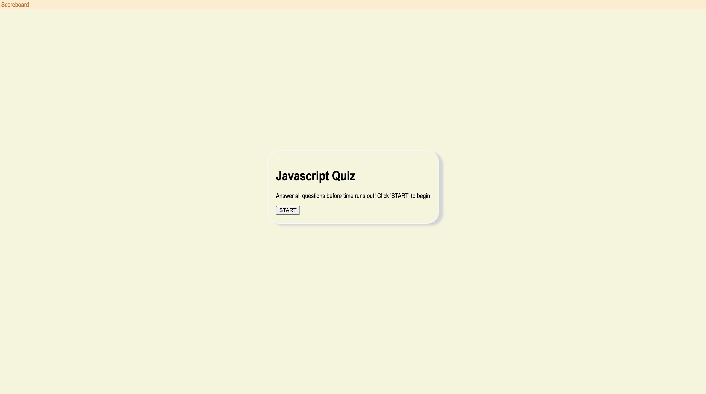

# code-quiz

## Description
A fun quiz to test your Javascript knowledge. There are 4 questions that must be answered before time runs out. Each wrong answer subtracts 10 seconds from time remaining. The scores are then stored in a scoreboard.

## Technology used
HTML, CSS, and Javascript

## Links

[Github Repo](https://github.com/puppetup/code-quiz)

[Deployed Site](https://puppetup.github.io/code-quiz/)

## Screenshot

## Credits
Made by Savino